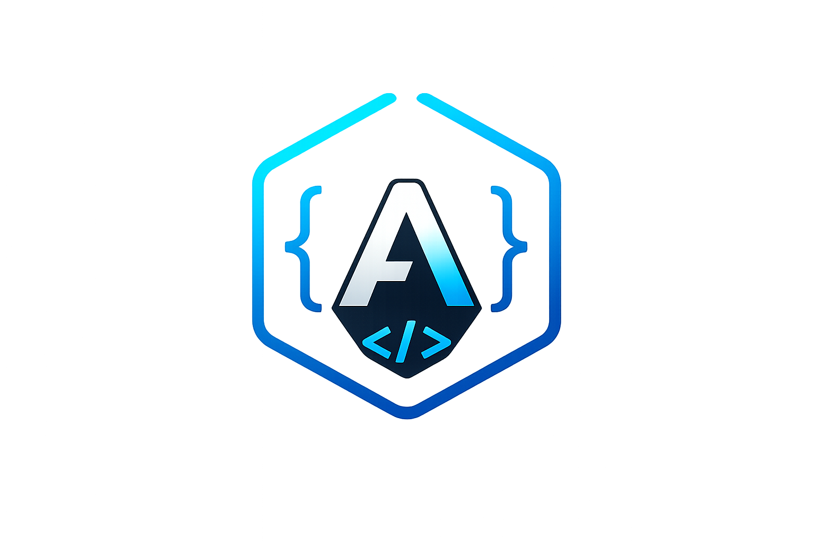
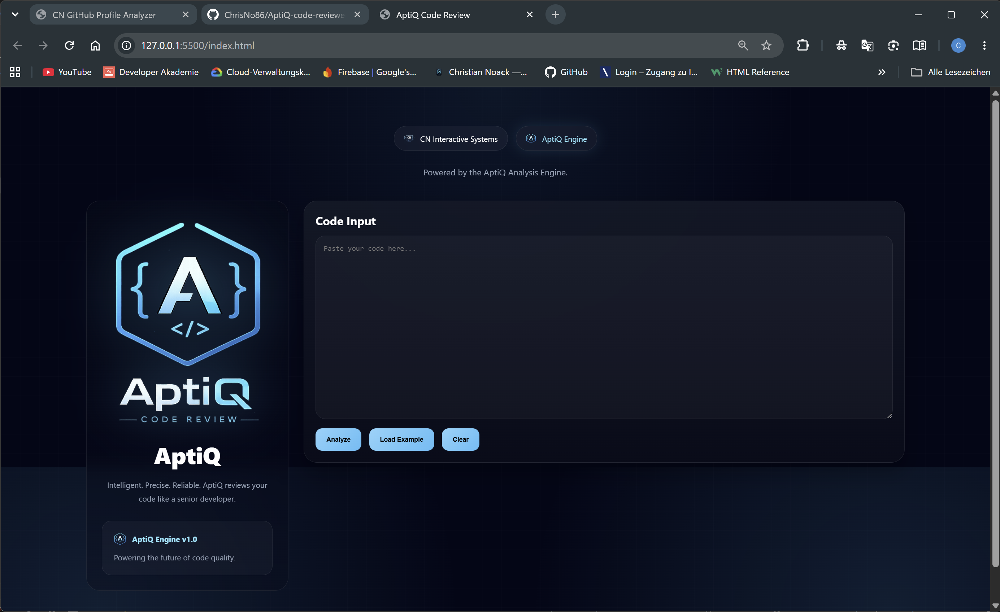

# AptiQ Code Review

<div align="center">



### Intelligent. Precise. Reliable.

Powered by the AptiQ Analysis Engine.

[Website](https://christian-noack.com) • [Developer](mailto:admin@christian-noack.com)

</div>

---

## Overview

AptiQ Code Review is a lightweight code analysis tool developed by CN Interactive Systems.

The application provides instant code reviews, quality scoring, statistics, and improvement recommendations directly in the browser.

AptiQ is designed as the first public module of the future AptiQ ecosystem.

---

## Features

- Code Quality Score
- Static Code Analysis
- Function Detection
- Variable Detection
- Comment Detection
- Line Statistics
- Character Statistics
- Improvement Suggestions
- Responsive Interface
- Premium AptiQ UI
- Privacy Friendly
- No Server Required

---

## Technologies

<p align="center">


</p>

---

## Screenshots

Place screenshots inside:

```text
assets/screenshots/
```

Example:

```md

```

---

## AptiQ Engine

AptiQ is the upcoming AI and software ecosystem developed by CN Interactive Systems.

Current public modules:

- AptiQ Code Review

Planned future modules:

- AptiQ Assistant
- AptiQ Studio
- AptiQ Analyze
- AptiQ Automation
- AptiQ Cloud

---

## Installation

```bash
git clone https://github.com/ChrisNo86/AptiQ-code-review.git
```

Open:

```text
index.html
```

No installation required.

---

## Project Structure

```text
AptiQ-Code-Review

├── assets
│   ├── aptiq-logo.png
│   ├── aptiq-icon.png
│   └── screenshots
│
├── index.html
├── style.css
├── main.js
│
├── LICENSE
└── README.md
```

---

## Copyright

© Christian Noack 2026 CN Interactive Systems

All rights reserved.

AptiQ™, AptiQ Engine™, AptiQ Code Review™, CN Interactive Systems™ and all associated logos are intellectual property of CN Interactive Systems.

---

## Contact

Website

https://christian-noack.com

Email

admin@christian-noack.com

---

## Disclaimer

This software is provided for educational and development purposes.

No warranties are given regarding functionality, suitability, security, or fitness for a particular purpose.

Use at your own risk.
